# VoteChain — Software Architecture Document

**Blockchain-based Mobile Voting System**

This document is the single source of truth for VoteChain system architecture. It defines structural decisions, component responsibilities, communication patterns, security boundaries, and deployment topology for developers and AI-assisted tooling (Cursor).

**Related documents:** [`PROJECT.md`](./PROJECT.md) · [`API.md`](./API.md) · [`DATABASE.md`](./DATABASE.md) · [`BLOCKCHAIN.md`](./BLOCKCHAIN.md) · [`AI_SERVICE.md`](./AI_SERVICE.md) · [`DEPLOYMENT.md`](./DEPLOYMENT.md)

---

## Table of Contents

1. [Architecture Style](#architecture-style)
2. [High-Level System Architecture](#high-level-system-architecture)
3. [Monorepo Structure](#monorepo-structure)
4. [Flutter Architecture](#flutter-architecture)
5. [Backend Architecture](#backend-architecture)
6. [AI Microservice Architecture](#ai-microservice-architecture)
7. [Blockchain Architecture](#blockchain-architecture)
8. [Authentication Flow](#authentication-flow)
9. [OCR Verification Flow](#ocr-verification-flow)
10. [Face Verification Flow](#face-verification-flow)
11. [Voting Flow](#voting-flow)
12. [Database Architecture](#database-architecture)
13. [API Communication](#api-communication)
14. [Security Architecture](#security-architecture)
15. [Deployment Architecture](#deployment-architecture)
16. [Scalability](#scalability)
17. [Engineering Decisions](#engineering-decisions)
18. [Conclusion](#conclusion)

---

## Architecture Style

VoteChain combines multiple complementary architectural patterns. Each was chosen to balance **maintainability**, **security**, **team velocity**, and **Final Year Project demonstrability**.

| Style | Application | Rationale |
|-------|-------------|-----------|
| **Monorepo Architecture** | Entire `VoteChain/` repository | Single workspace for mobile, admin, backend, AI, and blockchain. Shared docs, design assets, and Cursor rules stay synchronized. Simplifies local development and demo setup for a solo or small team. |
| **Clean Architecture** | Flutter features, backend services | Enforces dependency direction inward: UI depends on domain, domain depends on abstractions, data implements abstractions. Enables testability and swap-friendly infrastructure (e.g., mock repositories). |
| **Feature-First Flutter Architecture** | `mobile/lib/features/` | Groups code by voter capability (auth, OCR, voting) rather than by type (all models together). Features remain isolated and can be developed phase-by-phase per the project roadmap. |
| **Microservice Architecture (AI only)** | `ai-service/` | OCR, face recognition, and liveness detection are CPU/GPU-intensive and Python-native. Isolating them prevents blocking the Node.js event loop and allows independent scaling and model updates. |
| **REST API Communication** | All client ↔ server interaction | Universal, debuggable, stateless HTTP/JSON. Well-suited for Flutter (Dio), React, and FastAPI. Easier to document and test than GraphQL or gRPC for this project scope. |
| **Repository Pattern** | Flutter, Node.js backend | Abstracts data sources (MongoDB, REST, secure storage) behind interfaces. Controllers and widgets never query databases or APIs directly. |
| **Layered Backend Architecture** | `backend/src/` | Routes → Middleware → Controllers → Services → Repositories → Models. Clear separation of HTTP concerns, business rules, and persistence. |

---

## High-Level System Architecture

VoteChain follows a **hub-and-spoke** model: the Node.js backend orchestrates all business logic, persistence, AI verification, and blockchain submission. Clients never communicate directly with the AI service or Ethereum network.

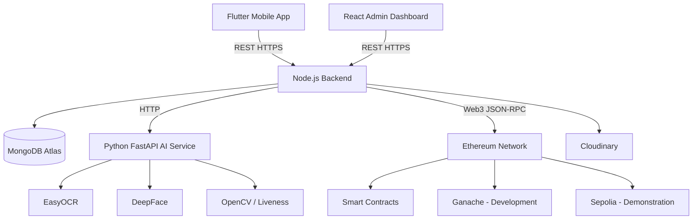

### Component Communication

| From | To | Protocol | Purpose |
|------|----|----------|---------|
| Flutter App | Node.js Backend | REST over HTTPS | Auth, elections, voting, profile, notifications |
| React Dashboard | Node.js Backend | REST over HTTPS | Election/candidate CRUD, analytics, admin auth |
| Node.js Backend | MongoDB Atlas | MongoDB Wire Protocol | Persistent storage for all off-chain data |
| Node.js Backend | AI Service | REST over HTTP | OCR, face registration, face verification, liveness |
| Node.js Backend | Ethereum (Ganache/Sepolia) | JSON-RPC via Web3 | Submit vote transactions via relayer wallet |
| Node.js Backend | Cloudinary | HTTPS REST API | Candidate images, document uploads |
| Flutter / React | AI Service | **Never direct** | All AI calls proxied through backend for security |
| Flutter / React | Ethereum | **Never direct** | Backend relayer holds private keys |

---

## Monorepo Structure

```text
VoteChain/
│
├── .cursor/                # Cursor AI rule files (.mdc) for scoped development guidance
├── docs/                   # Architecture, API, database, deployment documentation
├── design/                 # Google Stitch exports, logos, icons, design tokens
├── mobile/                 # Flutter voter application
├── backend/                # Node.js + Express REST API
├── admin/                  # React admin dashboard
├── ai-service/             # Python FastAPI AI microservice
├── blockchain/             # Solidity contracts, deploy scripts, tests
├── .gitignore
├── README.md
└── LICENSE
```

| Folder | Responsibility |
|--------|----------------|
| `.cursor/` | Project-specific AI rules enforcing architecture, naming, response formats, and development order |
| `docs/` | Single source of truth for product, architecture, API contracts, and deployment |
| `design/` | Google Stitch screen exports and visual assets — UI implementation must match these exactly |
| `mobile/` | Flutter app for voters: auth, OCR, face verification, election browsing, voting, receipts |
| `backend/` | Central API gateway, business logic, JWT auth, MongoDB access, AI/blockchain orchestration |
| `admin/` | React dashboard for Election Administrators and Super Administrators |
| `ai-service/` | Stateless FastAPI service for OCR, face recognition, and liveness detection |
| `blockchain/` | Solidity smart contracts, Hardhat/Truffle config, Ganache/Sepolia deploy scripts |

Each application contains its own `.env.example`. Secrets never leave environment files.

---

## Flutter Architecture

The Flutter mobile app follows **Clean Architecture** with a **feature-first** folder layout under `mobile/lib/`.

```text
lib/
│
├── core/                   # Constants, errors, extensions, base classes
├── shared/                 # Cross-feature models and utilities
├── services/               # App-wide services (Dio client, secure storage)
├── routes/                 # GoRouter route definitions
├── theme/                  # Material 3 theme (Poppins, Inter, color tokens)
├── widgets/                # Reusable UI components (buttons, cards, inputs)
└── features/               # Feature modules
    ├── auth/
    ├── ocr/
    ├── face_registration/
    ├── elections/
    ├── voting/
    └── ...
```

Each feature under `features/<name>/`:

```text
feature/
├── data/
│   ├── datasources/        # Remote/local data sources (API calls)
│   ├── models/             # DTOs with Freezed + json_serializable
│   └── repositories/       # Repository implementations
├── domain/
│   ├── entities/           # Pure business objects
│   ├── repositories/       # Repository interfaces (abstract)
│   └── usecases/           # Single-responsibility business operations
└── presentation/
    ├── controllers/        # Riverpod Notifiers (state management)
    ├── screens/            # Full-page Stitch-matched screens
    └── widgets/            # Feature-specific UI components
```

### Layer Responsibilities

| Layer | Responsibility | Depends On |
|-------|----------------|------------|
| **presentation/** | UI rendering, user input, Riverpod state watching | domain/ (via controllers) |
| **domain/** | Business rules, entities, repository contracts | Nothing external |
| **data/** | API calls (Dio), DTO mapping, repository implementations | domain/ interfaces, services/ |

### State Flow

```text
Screen (ConsumerWidget)
    → watches Controller (Riverpod Notifier)
        → calls Repository
            → calls DataSource (Dio / SecureStorage)
```

**Rules:** No business logic in widgets. No API calls from widgets. Approved packages only (Riverpod, GoRouter, Dio, Freezed, etc.).

---

## Backend Architecture

The Node.js backend uses a **layered MVC + Repository + Service** architecture.

```text
backend/src/
├── config/                 # Environment, DB connection, JWT config
├── routes/                 # Express route definitions
├── middleware/             # Auth, validation, error handling, rate limiting
├── controllers/            # Thin HTTP handlers
├── services/               # Business logic orchestration
├── repositories/           # MongoDB data access
├── models/                 # Mongoose schemas
├── validators/             # Request validation schemas (Joi/Zod)
└── utils/                  # Response helpers, crypto, logger
```

### Layer Responsibilities

| Layer | Responsibility |
|-------|----------------|
| **Routes** | Map HTTP verbs and paths to controller methods |
| **Middleware** | Cross-cutting concerns: JWT verification, input validation, error formatting, rate limiting |
| **Controllers** | Parse request, invoke service, return standardized JSON response — remain thin |
| **Services** | Business rules: eligibility checks, vote deduplication, AI/blockchain orchestration |
| **Repositories** | CRUD operations against MongoDB — no business logic |
| **Models** | Mongoose schema definitions, indexes, virtuals |
| **Validators** | Request body/param/query validation schemas |
| **Utilities** | Shared helpers: `response.js`, password hashing, JWT signing |

### Request Flow

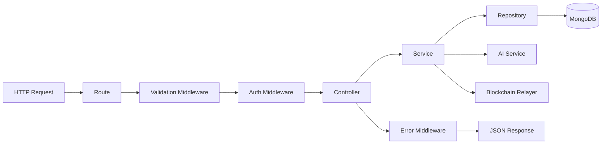

### Standard Response Envelope

Every endpoint returns:

```json
{
  "success": true,
  "message": "Description of result",
  "data": {},
  "errors": null
}
```

### Authentication & Error Handling

- **Authentication:** JWT access tokens on protected routes; refresh token rotation for session renewal.
- **Validation:** All mutating endpoints validated before reaching controllers.
- **Error Handling:** Centralized error middleware catches exceptions and returns consistent error envelopes — never raw stack traces to clients.

---

## AI Microservice Architecture

The AI service is a **stateless Python FastAPI microservice** at `ai-service/`. It is never called directly by Flutter or React — all requests are proxied through the Node.js backend.

```text
ai-service/app/
├── main.py                 # FastAPI application entry
├── routers/
│   ├── ocr.py              # CNIC document OCR endpoints
│   ├── face.py             # Face registration and verification
│   └── liveness.py         # Anti-spoofing liveness checks
├── services/
│   ├── ocr_service.py      # EasyOCR wrapper
│   ├── face_service.py     # DeepFace wrapper
│   └── liveness_service.py # OpenCV-based liveness
├── models/                 # Pydantic request/response schemas
└── utils/                  # Image preprocessing helpers
```

| Component | Technology | Purpose |
|-----------|------------|---------|
| **FastAPI** | Python web framework | Async HTTP endpoints, auto-generated OpenAPI docs |
| **EasyOCR** | OCR engine | Extract CNIC number, name, date of birth from document images |
| **DeepFace** | Face recognition | Generate face embeddings, compare live capture vs registered reference |
| **OpenCV** | Image processing | Preprocessing, quality checks, liveness detection heuristics |
| **Liveness Detection** | Custom + OpenCV | Detect photo/screen/mask spoofing before accepting biometrics |

### AI Request Flow

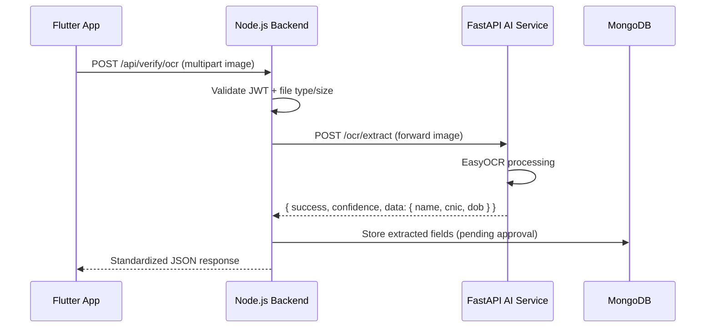

**Response format (mandatory):**

```json
{
  "success": true,
  "confidence": 99.2,
  "data": {
    "name": "",
    "cnic": "",
    "dob": ""
  }
}
```

**Constraints:** No database access from AI service. No blockchain logic. No frontend logic. Images processed in memory and discarded — never persisted by the AI service.

---

## Blockchain Architecture

VoteChain records vote integrity on **Ethereum** using **Solidity** smart contracts. Personal data never touches the chain.

### Smart Contracts

| Contract | Responsibility |
|----------|----------------|
| **Election Contract** | Manages election lifecycle: creation, activation, closure. Stores election metadata hash and status. |
| **Candidate Contract** | Registers candidates linked to an election. Stores candidate ID and metadata hash only. |
| **Vote Contract** | Accepts hashed vote submissions from the authorized backend relayer. Enforces one vote per hashed voter identifier per election. Emits events for audit. |

```text
blockchain/
├── contracts/
│   ├── ElectionFactory.sol
│   ├── Election.sol
│   ├── CandidateRegistry.sol
│   └── VoteRecorder.sol
├── scripts/                # Deploy to Ganache / Sepolia
├── test/                   # Contract unit tests
└── deployments/            # Addresses per network
```

### Network Environments

| Environment | Network | Usage |
|-------------|---------|-------|
| Development | **Ganache** (local) | Contract development, unit tests, rapid iteration |
| Demonstration | **Sepolia Testnet** | Final year project presentation, public verifiability |

### On-Chain Data Policy

**Stored on-chain:**

- Election ID
- Candidate ID
- Hashed voter identifier (keccak256 — never raw CNIC or user ID)
- Timestamp
- Transaction status

**Never stored on-chain:**

- Passwords, CNIC, facial data, images, emails, names, or any PII

### Transaction Lifecycle

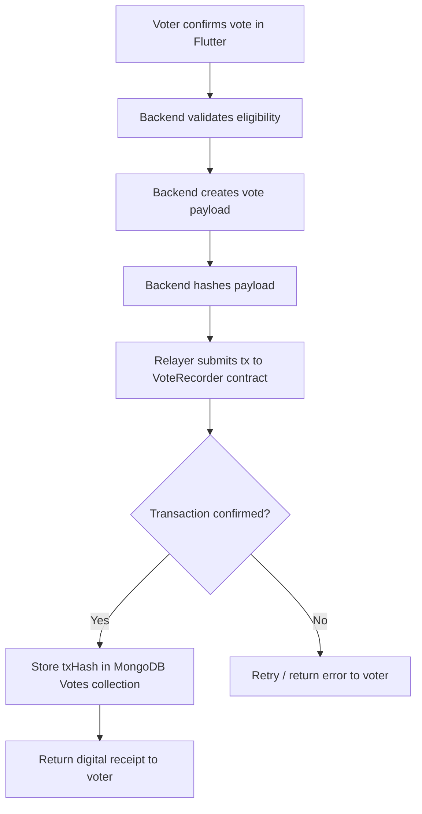

### Gas Optimization

- Use `mapping` lookups instead of array iteration where possible.
- Minimize storage writes — pack related flags into structs.
- Emit events for audit data instead of storing redundant on-chain records.
- Batch contract deployments via ElectionFactory pattern.

### Blockchain Architecture Diagram

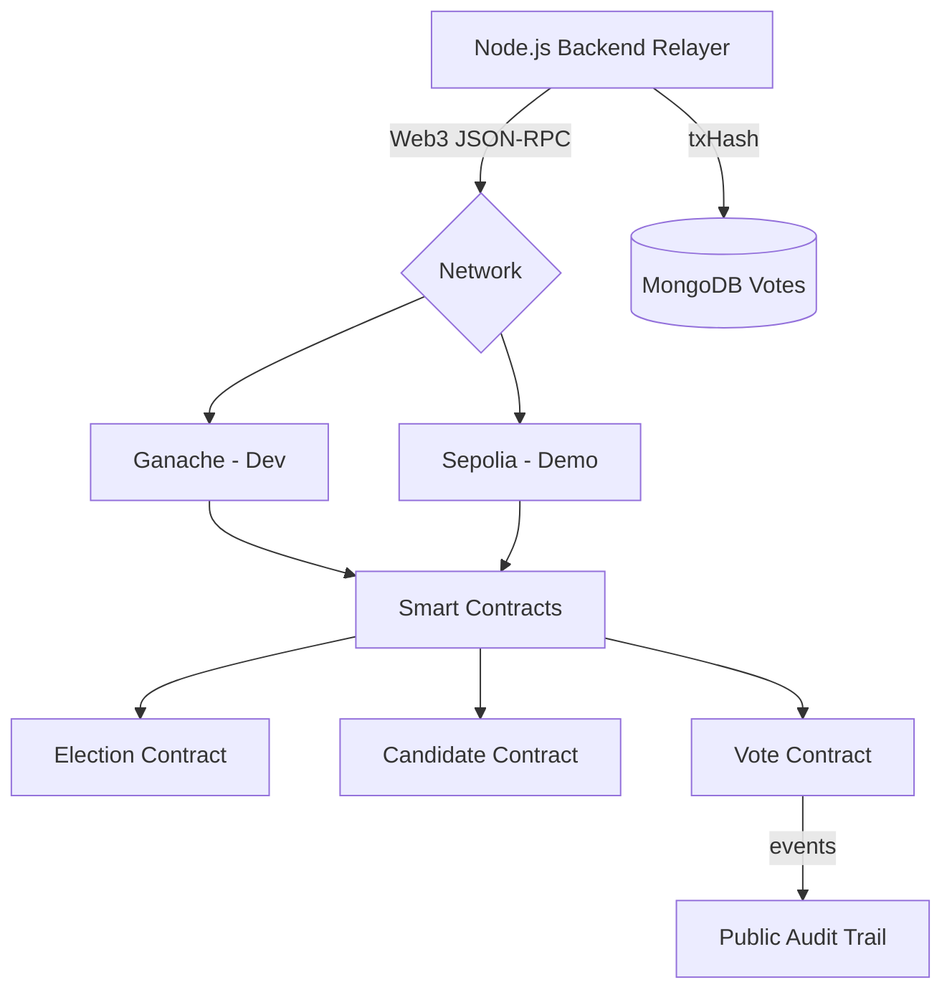

---

## Authentication Flow

VoteChain uses **JWT-based authentication** with **refresh tokens** and **role-based access control (RBAC)**.

### Roles

| Role | Scope |
|------|-------|
| Voter | Mobile app — browse elections, vote, manage profile |
| Election Administrator | Admin dashboard — manage elections within assigned organization |
| Super Administrator | Full platform control across all organizations |

### Registration & Approval Workflow

New voter registrations may require administrator approval before voting eligibility is granted (configurable per organization).

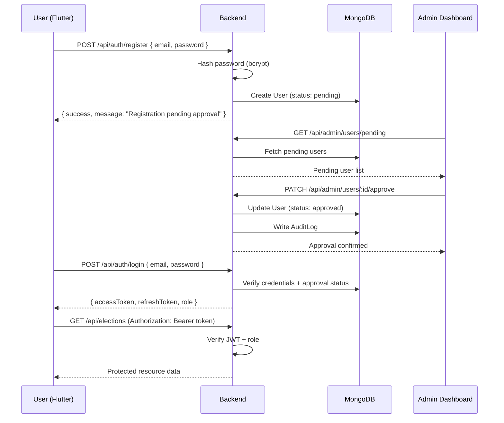

### Token Strategy

| Token | Lifetime | Storage |
|-------|----------|---------|
| Access Token (JWT) | Short (15–30 min) | Flutter secure storage / React memory |
| Refresh Token | Long (7 days) | Flutter secure storage / HttpOnly cookie (admin) |

Protected APIs require a valid JWT with the correct role claim. Middleware rejects expired or insufficient-privilege tokens before reaching controllers.

---

## OCR Verification Flow

CNIC document verification uses the AI service to extract identity fields during voter onboarding.

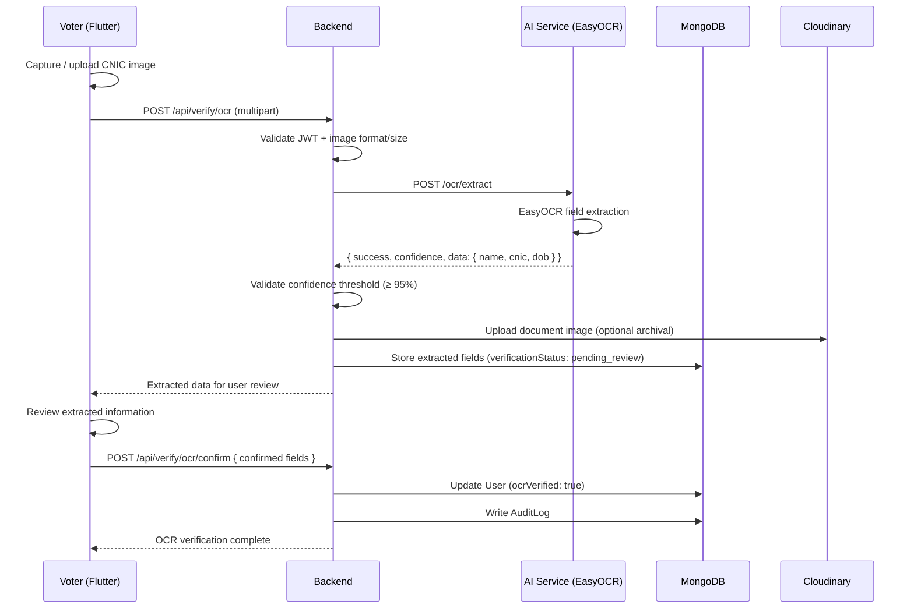

---

## Face Verification Flow

Face biometrics are registered during onboarding and re-verified before each vote cast.

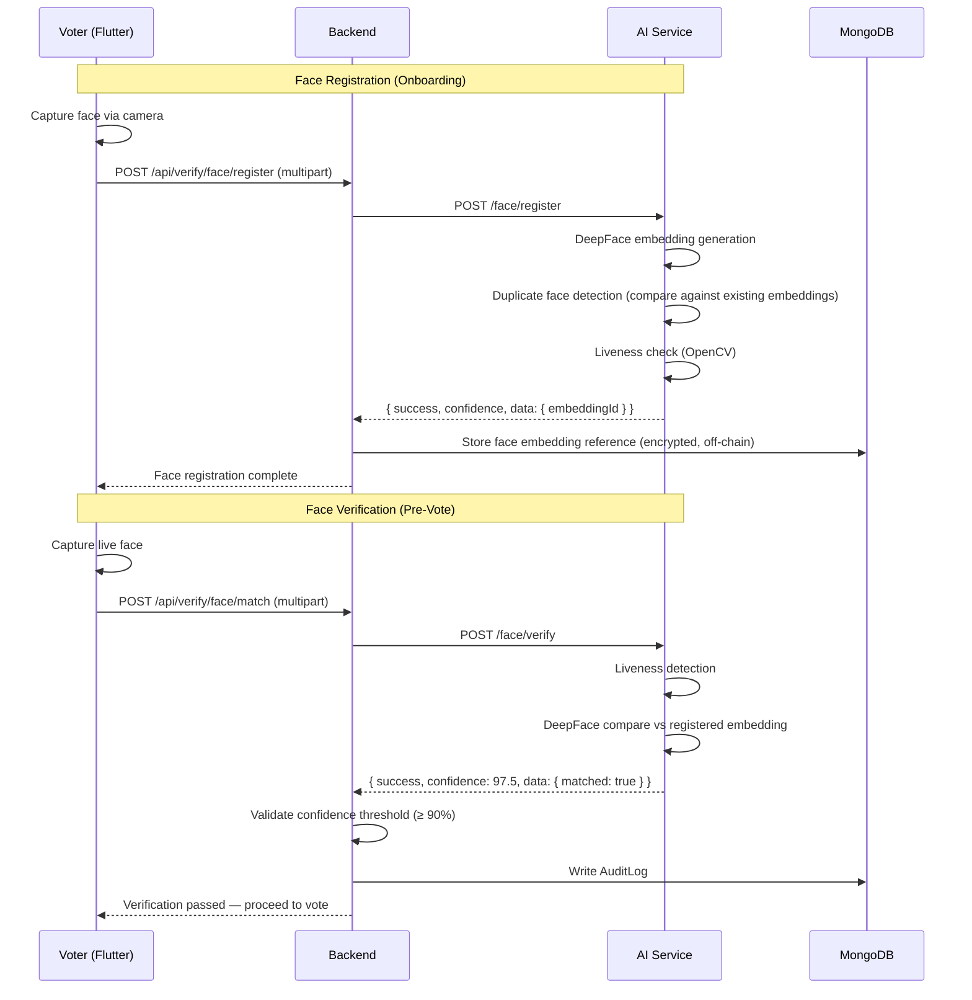

---

## Voting Flow

The complete vote casting lifecycle from election selection to blockchain receipt.

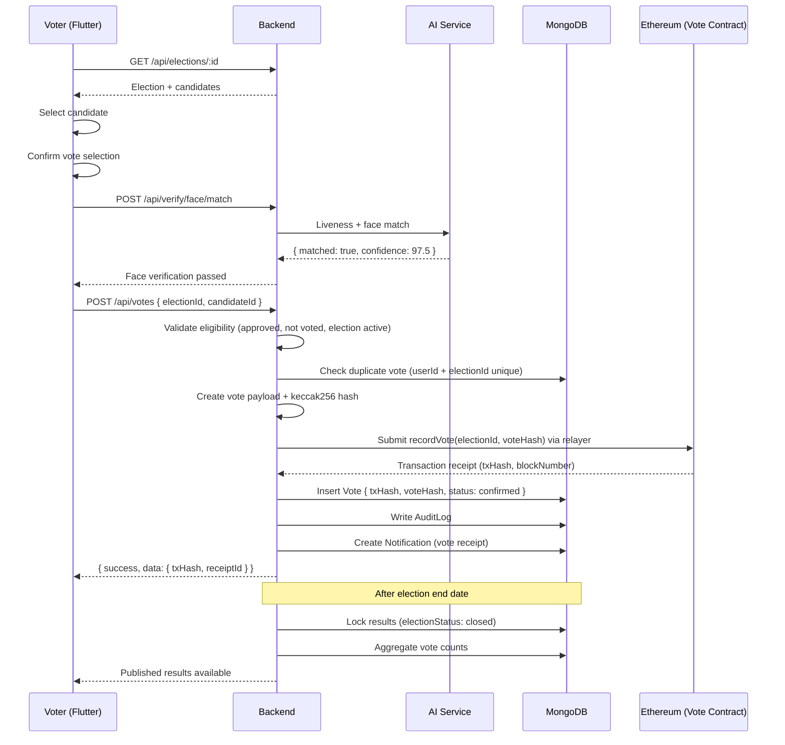

---

## Database Architecture

VoteChain uses **MongoDB Atlas** as the primary document database. All collections use **ObjectId references** — no embedded duplication of related documents.

### Collections

| Collection | Purpose |
|------------|---------|
| **Users** | Voter accounts: credentials, profile, OCR status, face embedding reference, approval status, role |
| **Admins** | Election Administrator and Super Administrator accounts (may extend Users with elevated roles) |
| **Elections** | Election metadata: title, description, schedule, status, organization reference |
| **Candidates** | Candidate profiles linked to elections: name, party, photo URL, manifesto |
| **Votes** | Off-chain vote records: userId, electionId, candidateId, voteHash, txHash, timestamp |
| **Notifications** | User notifications: election reminders, vote receipts, approval updates |
| **AuditLogs** | Immutable security event log: auth events, vote submissions, admin actions |

### Relationships

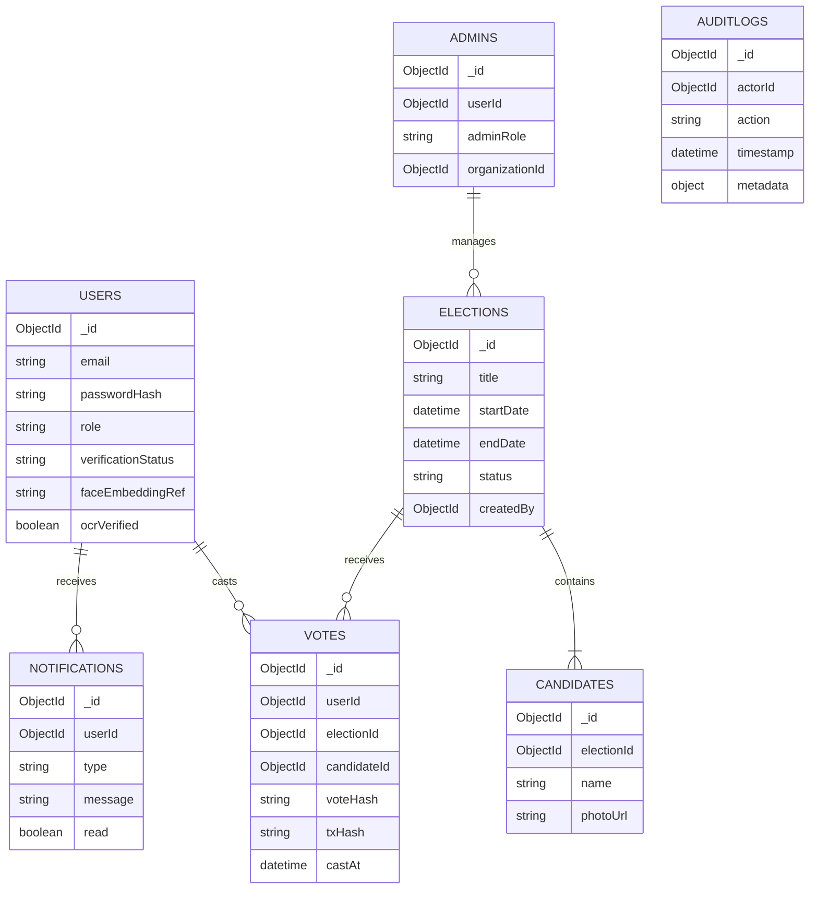

### Indexing Strategy

| Collection | Indexed Fields |
|------------|----------------|
| Users | `email` (unique), `cnic` (unique, sparse), `verificationStatus` |
| Elections | `status`, `startDate`, `endDate`, `createdBy` |
| Candidates | `electionId` |
| Votes | `userId + electionId` (unique compound), `electionId`, `txHash` |
| Notifications | `userId`, `read` |
| AuditLogs | `actorId`, `action`, `timestamp` |

---

## API Communication

### Communication Matrix

| Source | Destination | Type | Operations |
|--------|-------------|------|------------|
| Flutter | Backend | **Synchronous REST** | Auth, CRUD, voting, profile |
| React Admin | Backend | **Synchronous REST** | Election management, analytics |
| Backend | MongoDB | **Synchronous** | All persistence operations |
| Backend | AI Service | **Synchronous REST** | OCR, face register, face verify, liveness |
| Backend | Ethereum | **Asynchronous** | Vote tx submission (await confirmation) |
| Backend | Cloudinary | **Synchronous REST** | Image upload/retrieval |

### Synchronous vs Asynchronous

| Operation | Pattern | Reason |
|-----------|---------|--------|
| Login, OCR, face verify | Synchronous | User waits for immediate result in UI |
| Vote submission | Synchronous with async chain confirmation | Backend awaits tx receipt before returning receipt to voter |
| Notification delivery | Asynchronous (future) | Push notifications via background job queue |
| Result aggregation | Asynchronous | Triggered by election close cron/scheduler |
| Audit log writes | Fire-and-forget async | Non-blocking; must not delay API response |

Flutter and React **never** call the AI service or blockchain directly. The backend is the sole gateway.

---

## Security Architecture

| Control | Implementation |
|---------|----------------|
| **JWT Authentication** | Short-lived access tokens; refresh token rotation |
| **HTTPS** | TLS on all client-server and inter-service communication |
| **Password Hashing** | bcrypt with salt — plaintext passwords never stored |
| **Environment Variables** | All secrets in `.env` — JWT secret, MongoDB URI, RPC URLs, wallet keys, Cloudinary credentials |
| **Blockchain Security** | Relayer wallet on backend only; private keys never on client; hashed voter IDs on-chain |
| **Role-Based Access** | Middleware enforces Voter / Election Admin / Super Admin scopes |
| **Input Validation** | All request bodies, params, and queries validated before controllers |
| **Rate Limiting** | Applied to `/auth/login`, `/auth/register`, `/votes` endpoints |
| **Audit Logging** | All security-sensitive actions written to `AuditLogs` collection |
| **No Sensitive Data On-Chain** | Only election ID, candidate ID, hashed voter ID, timestamp, tx status |
| **Secure Face Embeddings** | Stored encrypted off-chain; AI service processes images in memory only |
| **File Upload Validation** | MIME type, file size, and dimension checks before AI processing |

---

## Deployment Architecture

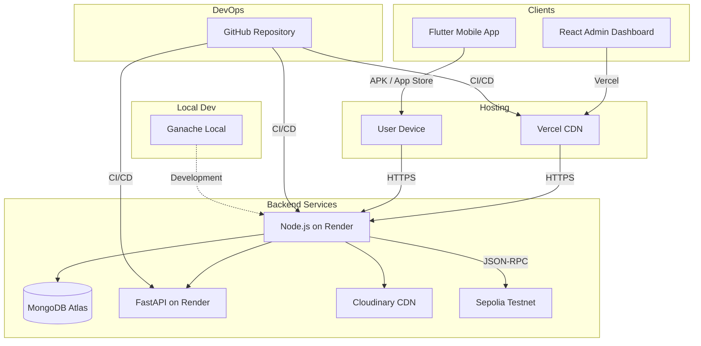

| Component | Platform | Purpose |
|-----------|----------|---------|
| **Flutter Mobile App** | Android APK / iOS (local build) | Voter application distributed to devices |
| **React Admin Dashboard** | **Vercel** | Static/hosted React SPA with CDN |
| **Node.js Backend** | **Render** | Express API server with auto-deploy from GitHub |
| **MongoDB Atlas** | MongoDB Cloud | Managed document database with backups |
| **FastAPI AI Service** | **Render** | Python microservice with GPU-compatible instance (if needed) |
| **Ethereum** | **Ganache** (dev) / **Sepolia** (demo) | Smart contract deployment and vote recording |
| **Cloudinary** | Cloudinary CDN | Candidate photos, document image storage |
| **GitHub** | Version control + CI/CD | Source of truth, automated deployments |

All environment-specific configuration lives in `.env` files per service. `.env.example` files document required variables without values.

---

## Scalability

VoteChain's architecture supports growth across multiple dimensions without fundamental redesign.

### More Users

- **Backend:** Horizontal scaling on Render — multiple Node.js instances behind a load balancer.
- **MongoDB:** Atlas auto-scaling tiers; read replicas for election browsing queries.
- **AI Service:** Independent scaling — OCR/face workloads do not affect API latency.
- **JWT statelessness:** No server-side session store required for auth scaling.

### More Elections

- **Database:** Indexed `electionId` and `status` fields; paginated election listing APIs.
- **Blockchain:** ElectionFactory pattern deploys per-election contract instances.
- **Admin:** Role-scoped queries ensure administrators only see their organization's elections.

### Government-Scale Deployment

- Replace Render with Kubernetes or cloud-native containers (AWS ECS, GCP Cloud Run).
- Introduce message queues (Redis/RabbitMQ) for async vote processing and notification delivery.
- Add CDN caching for static election content and candidate profiles.
- Multi-region MongoDB Atlas deployment for geographic redundancy.
- Formal security audits, penetration testing, and compliance certification (ISO 27001).

### Future Biometric Methods

- AI microservice architecture allows adding new routers (e.g., `/fingerprint`, `/iris`) without changing backend or Flutter core architecture.
- New biometric modules follow the same `{ success, confidence, data }` response contract.

### Future Blockchain Networks

- Abstract blockchain interaction behind a `BlockchainService` interface in the backend.
- Swap Ganache/Sepolia for Polygon, Hyperledger, or custom L2 by changing RPC URL and contract addresses — no client changes required.

---

## Engineering Decisions

| Decision | Choice | Reasoning |
|----------|--------|-----------|
| State management | **Riverpod** | Compile-safe, testable, no BuildContext dependency; official Flutter team recommendation; supports async providers natively |
| Database | **MongoDB Atlas** | Flexible document schema suits evolving election/vote models; managed cloud service reduces DevOps overhead for FYP timeline |
| AI framework | **FastAPI** | Native Python ecosystem for EasyOCR/DeepFace; async support; auto-generated OpenAPI docs; easy to containerize |
| API style | **REST** | Universal tooling support; simple to debug; adequate for CRUD + voting flows; no GraphQL complexity needed |
| Blockchain | **Ethereum** | Mature tooling (Hardhat, Ganache, Sepolia); public auditability; industry recognition for FYP demonstration |
| Architecture | **Clean Architecture** | Testable layers; swap-friendly repositories; enforces separation of UI and business logic |
| UI framework | **Material 3** | Official Flutter design system; dark premium theme support; matches Google Stitch export compatibility |
| Monorepo | **Single repository** | Shared docs, design assets, and Cursor rules; simplified clone-and-run for evaluators |
| Auth | **JWT + Refresh** | Stateless API scaling; mobile-friendly; industry standard for SPAs and mobile apps |
| Image storage | **Cloudinary** | Managed CDN with transformations; offloads storage from MongoDB and backend |
| Admin hosting | **Vercel** | Zero-config React deployment; CDN; free tier suitable for FYP |
| Backend hosting | **Render** | Simple Node.js + Python deployment; GitHub auto-deploy; free tier for demo |
| On-chain data | **Hashes only** | Privacy compliance; reduces gas costs; PII stays off public ledger |
| AI isolation | **Separate microservice** | Python ML libraries incompatible with Node.js; independent scaling; failure isolation |

---

## Conclusion

VoteChain's architecture is designed as a **production-quality foundation** for a secure, transparent, and intelligent mobile voting platform. Key architectural guarantees:

**Maintainability** — Clean Architecture, feature-first modules, Repository Pattern, and monorepo documentation ensure any developer (or AI assistant) can locate, understand, and extend code without breaking existing features.

**Scalability** — Stateless API, isolated AI microservice, MongoDB Atlas auto-scaling, and abstracted blockchain layer support growth from university elections to national deployment.

**Security** — JWT authentication, RBAC, bcrypt hashing, HTTPS everywhere, rate limiting, audit logging, and a strict no-PII-on-chain policy protect voter identity and election integrity.

**Transparency** — Ethereum vote recording on Sepolia provides a publicly verifiable audit trail while preserving voter privacy through hashed identifiers.

This document should be updated whenever a major architectural decision changes. All implementation work must align with this document, [`PROJECT.md`](./PROJECT.md), and the Cursor rules in `.cursor/rules/`.

---

*VoteChain Architecture Document — Version 1.0*
