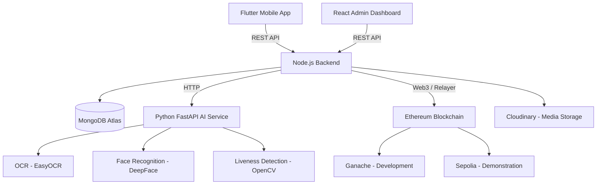

# VoteChain

**Secure, Transparent, and Intelligent Mobile Voting**

---

## Table of Contents

1. [Project Description](#project-description)
2. [Product Vision](#product-vision)
3. [Problem Statement](#problem-statement)
4. [Objectives](#objectives)
5. [Target Users](#target-users)
6. [User Roles](#user-roles)
7. [Core Features](#core-features)
8. [Technology Stack](#technology-stack)
9. [System Components](#system-components)
10. [High-Level Architecture](#high-level-architecture)
11. [Development Strategy](#development-strategy)
12. [Folder Structure](#folder-structure)
13. [Design System](#design-system)
14. [Security Principles](#security-principles)
15. [Development Principles](#development-principles)
16. [Success Criteria](#success-criteria)

---

## Project Description

VoteChain is a blockchain-powered mobile voting platform designed for universities, educational institutions, organizations, clubs, NGOs, and future government elections.

The platform combines **Artificial Intelligence**, **OCR**, **Face Recognition**, and **Ethereum Blockchain** to provide secure voter verification and tamper-proof voting. Voters authenticate their identity through document scanning and biometric matching before casting a vote that is immutably recorded on-chain.

### System Overview

VoteChain is delivered as a monorepo containing six independently developed applications that share documentation and design assets:

| Component | Purpose |
|-----------|---------|
| Flutter Mobile Application | Voter-facing mobile experience |
| React Admin Dashboard | Election administration and analytics |
| Node.js Backend | REST API, business logic, orchestration |
| MongoDB Atlas | Primary data store |
| Python FastAPI AI Service | OCR, face recognition, liveness detection |
| Ethereum Smart Contracts | Tamper-proof vote recording |

### Network Environments

| Environment | Network | Usage |
|-------------|---------|-------|
| Development | Ganache (local) | Smart contract development and testing |
| Demonstration | Sepolia Testnet | Final year project presentation and staging |

---

## Product Vision

Create a secure, modern, government-grade voting platform that allows verified users to participate in elections while ensuring **transparency**, **privacy**, and **trust** through blockchain technology.

VoteChain aims to replace fragile, centralized e-voting systems with a decentralized architecture where every vote is cryptographically verifiable, every identity is AI-validated, and every election is auditable — without exposing personal data on the public ledger.

---

## Problem Statement

Traditional electronic voting systems often suffer from fundamental weaknesses that undermine voter confidence and election integrity:

| Problem | Impact |
|---------|--------|
| Centralized databases | Single point of failure; vulnerable to tampering |
| Weak authentication | Unauthorized or duplicate voting |
| Duplicate voting | Inflated or fraudulent results |
| Lack of transparency | Voters cannot verify their vote was counted |
| Difficult auditing | Post-election verification is costly and unreliable |

VoteChain addresses these issues through a layered approach:

- **AI-based identity verification** ensures only eligible, registered voters can participate.
- **Blockchain vote recording** provides an immutable, publicly verifiable audit trail.
- **Role-based access control** separates voter, administrator, and super-administrator capabilities.
- **Off-chain PII with on-chain hashes** preserves voter privacy while maintaining integrity.

---

## Objectives

### Short-Term Objectives

- Enable secure **university and campus elections** with verified student voters.
- Support **organization and club elections** for internal governance.
- Implement **AI-powered voter verification** using CNIC OCR and face recognition.
- Deliver a functional **mobile voting experience** with digital vote receipts.
- Provide an **admin dashboard** for election and candidate management.
- Demonstrate **blockchain vote recording** on Sepolia Testnet.

### Long-Term Objectives

- Extend the platform to **government-level elections** with regulatory compliance.
- Add **multi-language support** for national-scale deployment.
- Achieve **national-scale deployment** with high availability and horizontal scaling.
- Integrate advanced analytics, fraud detection, and real-time result reporting.
- Pursue formal security audits and certification for production use.

---

## Target Users

### Primary Users

| User Group | Description |
|------------|-------------|
| University Students | Registered voters participating in campus elections |
| Educational Institutions | Universities and colleges hosting elections |
| Clubs | Student organizations running internal votes |
| NGOs | Non-profits conducting member elections |
| Organizations | Companies and associations with governance voting needs |

### Secondary Users

| User Group | Description |
|------------|-------------|
| Election Administrators | Staff managing elections, candidates, and results |
| Super Administrators | Platform owners with full system control |

### Future Users

| User Group | Description |
|------------|-------------|
| Government Election Authorities | National and regional election commissions |

---

## User Roles

### 1. Voter

Registered users who verify their identity and cast votes in active elections.

**Permissions:**

- Register and authenticate via email/password and JWT
- Complete CNIC OCR verification during onboarding
- Register face biometrics for future verification
- Verify identity via face match before voting
- Browse active and upcoming elections
- View candidate profiles and manifestos
- Cast a single vote per election
- Receive a digital vote receipt with blockchain transaction reference
- View personal voting history
- Manage profile settings
- Receive push/in-app notifications

**Restrictions:**

- Cannot vote more than once per election
- Cannot access admin or election management features
- Cannot view other voters' choices or identities

---

### 2. Election Administrator

Staff members responsible for managing elections within their assigned organization or institution.

**Permissions:**

- Access the React Admin Dashboard
- Create, edit, and publish elections
- Add, edit, and remove candidates
- Set election schedules (start/end dates)
- Monitor live voting progress and turnout
- View election results and analytics reports
- Send notifications to voters
- Export election data and audit logs

**Restrictions:**

- Cannot manage users outside their organization scope
- Cannot modify platform-wide settings
- Cannot access super-administrator functions
- Cannot view raw biometric data or CNIC numbers (masked access only)

---

### 3. Super Administrator

Platform-level administrators with full control over the VoteChain system.

**Permissions:**

- All Election Administrator permissions across all organizations
- Create and manage Election Administrator accounts
- Manage platform-wide settings and configurations
- View system-wide audit logs and security events
- Manage blockchain contract deployments and relayer wallets
- Access all reports, analytics, and system health metrics
- Suspend or deactivate users and elections

**Restrictions:**

- Cannot decrypt or view raw biometric embeddings
- Cannot alter recorded blockchain vote data
- Cannot bypass audit logging

---

## Core Features

### Mobile Application (Voter)

| Feature | Description |
|---------|-------------|
| **Authentication** | Secure login, registration, and JWT session management |
| **OCR CNIC Verification** | Scan and extract identity data from CNIC documents via AI |
| **Face Registration** | Capture and store face biometrics during onboarding |
| **Face Verification** | Live face match before voting to prevent impersonation |
| **Election Browsing** | Discover active, upcoming, and past elections |
| **Candidate Profiles** | View candidate details, photos, and manifestos |
| **Secure Voting** | Cast an encrypted, one-time vote per election |
| **Blockchain Vote Recording** | Submit vote hash to Ethereum for immutability |
| **Digital Vote Receipt** | Receive confirmation with transaction hash |
| **Election Results** | View published results after election closure |
| **Notifications** | Receive alerts for election events and reminders |
| **Profile Management** | Update account settings and view voting history |

### Admin Dashboard

| Feature | Description |
|---------|-------------|
| **Admin Dashboard** | Overview of elections, voters, and system metrics |
| **Election Management** | Create, schedule, publish, and close elections |
| **Candidate Management** | Add and manage candidates per election |
| **Reports & Analytics** | Turnout statistics, result breakdowns, and audit exports |

---

## Technology Stack

| Category | Technology | Purpose |
|----------|------------|---------|
| Mobile Framework | **Flutter** | Cross-platform voter mobile application |
| Admin Frontend | **React.js** | Election administration dashboard |
| Backend Runtime | **Node.js** | Server-side JavaScript runtime |
| Backend Framework | **Express** | REST API and middleware |
| Database | **MongoDB Atlas** | Cloud-hosted document database |
| AI Framework | **Python FastAPI** | High-performance AI microservice |
| OCR Engine | **EasyOCR** | CNIC document text extraction |
| Face Recognition | **DeepFace** | Biometric face matching and verification |
| Blockchain Platform | **Ethereum** | Decentralized vote recording |
| Smart Contract Language | **Solidity** | On-chain election and vote contracts |
| Local Blockchain | **Ganache** | Development and unit testing |
| Test Network | **Sepolia** | Demonstration and staging deployments |
| Authentication | **JWT** | Stateless token-based auth |
| Media Storage | **Cloudinary** | Candidate images and document uploads |
| Version Control | **GitHub** | Source control and collaboration |
| AI Development | **Cursor AI** | AI-assisted development environment |
| UI Design | **Google Stitch** | Screen design and prototyping |

---

## System Components

### Flutter Mobile Application

The primary voter-facing client built with Flutter and Material 3. Handles user authentication, identity verification (OCR and face), election browsing, secure voting, and vote receipt display. Communicates exclusively with the Node.js backend via REST API using Dio.

### React Admin Dashboard

The web-based administration portal for Election Administrators and Super Administrators. Provides election lifecycle management, candidate administration, live monitoring, result publishing, and analytics reporting.

### Node.js Backend

The central orchestration layer built with Express. Manages authentication (JWT), business logic, data persistence (via Repository Pattern), AI service communication, blockchain transaction submission, and notification delivery. Serves both the Flutter app and React dashboard.

### MongoDB Atlas

The cloud-hosted primary database storing users, elections, candidates, votes (off-chain references), notifications, and audit logs. Uses ObjectId references between collections — no data duplication.

### Python FastAPI AI Service

A stateless microservice handling OCR (EasyOCR), face recognition (DeepFace), and liveness detection (OpenCV). Called by the backend via HTTP. Processes images in memory and returns structured JSON — never persists biometric data.

### Ethereum Blockchain

Smart contracts written in Solidity record vote hashes and transaction references on-chain. Ganache is used during development; Sepolia Testnet is used for demonstrations. No personal information is stored on-chain.

---

## High-Level Architecture



### Data Flow Summary

1. **Voter** authenticates and verifies identity via the Flutter app.
2. **Flutter** sends requests to the **Node.js Backend** over HTTPS.
3. **Backend** validates requests, applies business rules, and persists data to **MongoDB**.
4. For identity verification, **Backend** forwards images to the **AI Service** and stores results.
5. When a vote is cast, **Backend** submits a hashed vote record to **Ethereum** via a relayer wallet.
6. **Transaction hash** is stored in MongoDB and returned to the voter as a digital receipt.
7. **Administrators** manage elections and view analytics through the **React Dashboard**.

---

## Development Strategy

VoteChain follows a strict phased development approach. **Each phase must be completed before the next begins.** Do not jump ahead.

| Phase | Name | Deliverables |
|-------|------|--------------|
| **1** | Flutter Setup | Project scaffold, folder structure, dependencies, environment config, theme foundation |
| **2** | Authentication | Login, registration, JWT flow, secure storage, auth screens matching Stitch designs |
| **3** | OCR Verification | CNIC scanning UI, backend OCR integration, identity extraction and validation |
| **4** | Face Recognition | Face registration, liveness detection, face verification before voting |
| **5** | Home Dashboard | Voter home screen, navigation, election cards, notification bell |
| **6** | Election Management | Election listing, candidate profiles, election detail screens, backend CRUD |
| **7** | Voting | Secure vote casting flow, confirmation screen, digital vote receipt |
| **8** | Blockchain | Solidity contracts, Ganache testing, Sepolia deployment, backend relayer integration |
| **9** | Admin Dashboard | React scaffold, election/candidate management, reports and analytics |
| **10** | Testing | Unit tests, integration tests, end-to-end voting flow validation |
| **11** | Deployment | Production environment setup, CI/CD, documentation finalization, demo preparation |

---

## Folder Structure

VoteChain uses a **monorepo architecture**. Each application is developed independently while sharing documentation and design assets.

```text
VoteChain/
│
├── mobile/                 # Flutter voter application
│   └── lib/
│       ├── core/
│       ├── shared/
│       ├── features/
│       ├── services/
│       ├── routes/
│       ├── theme/
│       └── widgets/
│
├── admin/                  # React admin dashboard
│
├── backend/                # Node.js + Express REST API
│   └── src/
│       ├── config/
│       ├── controllers/
│       ├── middleware/
│       ├── models/
│       ├── repositories/
│       ├── services/
│       ├── routes/
│       ├── utils/
│       └── validators/
│
├── ai-service/             # Python FastAPI AI microservice
│   └── app/
│       ├── routers/
│       ├── services/
│       ├── models/
│       └── utils/
│
├── blockchain/             # Solidity smart contracts
│   ├── contracts/
│   ├── scripts/
│   ├── test/
│   └── deployments/
│
├── docs/                   # Project documentation
│   ├── PROJECT.md
│   ├── ARCHITECTURE.md
│   ├── API.md
│   ├── DATABASE.md
│   ├── BLOCKCHAIN.md
│   ├── AI_SERVICE.md
│   ├── DEPLOYMENT.md
│   └── cursor_rules.md
│
├── design/                 # Google Stitch design exports
│   ├── stitch-screens/
│   ├── logo/
│   ├── icons/
│   ├── illustrations/
│   └── assets/
│
├── .cursor/                # Cursor AI development rules
│   └── rules/
│
├── .gitignore
├── README.md
└── LICENSE
```

---

## Design System

VoteChain follows a premium, government-fintech design language implemented via **Material 3** and exported **Google Stitch** screen designs.

### Visual Identity

| Element | Specification |
|---------|---------------|
| Design Framework | Material 3 |
| Theme | Dark Premium Theme |
| Design Source | Google Stitch (exported to `design/stitch-screens/`) |
| Primary Typography | Poppins |
| Secondary Typography | Inter |
| Primary Color | Emerald Green |
| Secondary Color | Royal Blue |
| Background Color | Deep Navy |
| Component Style | Rounded components with subtle elevation |
| Overall Aesthetic | Government Fintech Style — trustworthy, modern, authoritative |

### Design Rules

- All screens must **exactly match** Google Stitch exports — no redesigns unless explicitly requested.
- Use theme tokens for colors, spacing, typography, and border radius — never hardcode values.
- Maintain consistent spacing on a **4dp / 8dp grid**.
- Keep animations **subtle** — Material motion defaults only.
- Extract repeated UI patterns into reusable components shared across Flutter and React.

---

## Security Principles

| Principle | Implementation |
|-----------|----------------|
| **JWT Authentication** | Stateless token-based auth for all protected API routes |
| **Role-Based Access Control** | Voter, Election Administrator, and Super Administrator permissions enforced at API and UI layers |
| **Password Hashing** | bcrypt hashing — passwords never stored in plaintext |
| **Encrypted Communication** | HTTPS/TLS for all client-server and inter-service communication |
| **Blockchain Integrity** | Vote hashes immutably recorded on Ethereum; tampering is cryptographically detectable |
| **No PII On-Chain** | CNIC, biometrics, emails, and personal data never stored on the blockchain |
| **Secure Face Embeddings** | Biometric data processed in memory by the AI service; embeddings stored securely off-chain |
| **Environment Variables** | All secrets (JWT, MongoDB URI, RPC URLs, wallet keys, Cloudinary) in `.env` files only |
| **Audit Logging** | All security-sensitive actions logged to the `AuditLogs` collection |
| **Rate Limiting** | Auth and voting endpoints protected against brute-force and spam |

---

## Development Principles

All code across the VoteChain monorepo adheres to these engineering standards:

| Principle | Application |
|-----------|-------------|
| **Clean Architecture** | Strict layer separation: presentation → domain → data |
| **Feature-First** | Code organized by feature (auth, elections, voting), not by file type |
| **Repository Pattern** | All data access through repositories — no direct DB queries in controllers or widgets |
| **SOLID** | Single responsibility, open/closed, Liskov substitution, interface segregation, dependency inversion |
| **DRY** | Don't repeat yourself — extract shared logic into reusable modules |
| **KISS** | Keep it simple — avoid premature abstraction and over-engineering |
| **Reusable Components** | Shared widgets, services, and utilities promoted to `core/`, `shared/`, or `widgets/` |

Detailed rules for AI-assisted development are defined in `docs/cursor_rules.md` and `.cursor/rules/`.

---

## Success Criteria

The VoteChain project is considered successfully delivered when all of the following measurable criteria are met:

### UI & Design

- [ ] All Flutter screens implemented and matching Google Stitch designs
- [ ] Material 3 dark premium theme applied consistently across mobile app
- [ ] React admin dashboard visually aligned with mobile design language
- [ ] Reusable component library established for both Flutter and React

### Authentication & Identity

- [ ] User registration and login functional with JWT session management
- [ ] OCR CNIC verification achieves ≥ 95% field extraction accuracy on clear documents
- [ ] Face registration captures and stores biometrics successfully
- [ ] Face verification correctly matches registered users with ≥ 90% confidence threshold
- [ ] Liveness detection rejects static photo spoofing attempts

### Voting & Elections

- [ ] Voters can browse elections and view candidate profiles
- [ ] Secure one-vote-per-election enforcement verified
- [ ] Digital vote receipt generated with valid transaction reference
- [ ] Election results displayed accurately after closure

### Blockchain

- [ ] Smart contracts deployed and tested on Ganache
- [ ] Smart contracts deployed on Sepolia Testnet for demonstration
- [ ] Vote hashes recorded on-chain with no PII exposure
- [ ] Backend relayer successfully submits and confirms transactions

### Admin Dashboard

- [ ] Election Administrators can create, manage, and close elections
- [ ] Candidate management (add, edit, remove) fully functional
- [ ] Reports and analytics display turnout and result breakdowns
- [ ] Role-based access enforced for all admin operations

### Quality & Deployment

- [ ] End-to-end voting flow tested (register → verify → vote → receipt)
- [ ] Unit and integration tests passing for critical paths
- [ ] All services deployed and accessible for demonstration
- [ ] Documentation complete (`PROJECT.md`, `ARCHITECTURE.md`, `API.md`, `DEPLOYMENT.md`)
- [ ] Successful live demonstration on Sepolia Testnet

---

*VoteChain — Final Year Project. Documentation version 1.0.*
