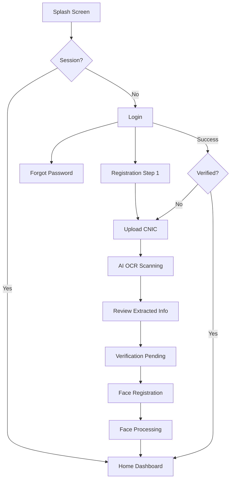
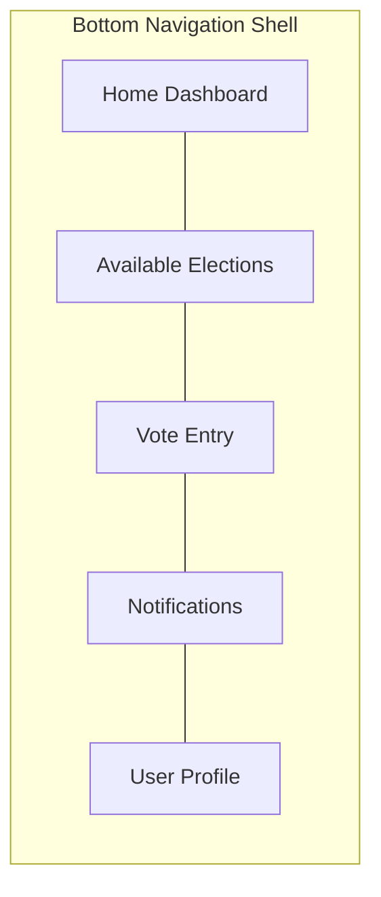
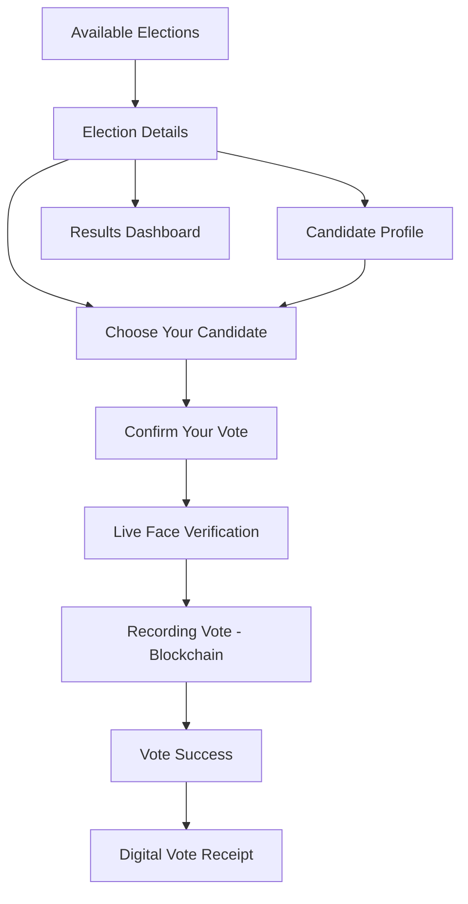

# VoteChain — Stitch UI Analysis & Flutter Implementation Guide

**Analysis-only document.** No Flutter code. Use this as the blueprint before implementing any screen.

**Sources analyzed:**
- Google Stitch MCP — project `6109903895886936453` (`VoteChain Blockchain Splash Screen`)
- Stitch design system: **Sovereign Ledger** (display name) → documented as **VoteChain Design System**
- [`docs/DESIGN.md`](./DESIGN.md) · [`docs/PROJECT.md`](./PROJECT.md) · [`docs/ARCHITECTURE.md`](./ARCHITECTURE.md)
- Cursor rules: `.cursor/rules/flutter.mdc`, `.cursor/rules/ui.mdc`

**Stitch project:** `6109903895886936453`  
**Device type (mobile):** `MOBILE` (390–780 logical width)  
**Device type (admin):** `DESKTOP` (1280–2560 width)  
**Total screens in project:** 62 (including assets, composites, and admin)

---

## Table of Contents

1. [Executive Summary](#1-executive-summary)
2. [Design System Analysis](#2-design-system-analysis)
3. [Reusable UI Components](#3-reusable-ui-components)
4. [Screen Inventory & Hierarchy](#4-screen-inventory--hierarchy)
5. [Navigation Flow](#5-navigation-flow)
6. [Assets Catalog](#6-assets-catalog)
7. [Recommended Flutter Widget Library](#7-recommended-flutter-widget-library)
8. [Implementation Priority & Phase Mapping](#8-implementation-priority--phase-mapping)
9. [Cross-Reference Checklist](#9-cross-reference-checklist)

---

## 1. Executive Summary

VoteChain's Stitch project delivers a **complete dark-mode, Material 3, government-fintech UI** for:

| Surface | Screen Count | Primary Use |
|---------|--------------|-------------|
| **Flutter Mobile** | ~28 interactive screens + 2 pattern composites | Voter journey: auth → verification → elections → voting → receipt |
| **React Admin** | 10 desktop screens | Election admin, monitoring, analytics, settings |
| **Design Assets** | ~22 illustrations, logo, shaders, SVGs | Branding, empty states, onboarding, loading |
| **Documentation** | 2 meta screens | Design system reference inside Stitch |

The visual language is consistent across all mobile screens: **Deep Navy backgrounds**, **Emerald Green primary actions**, **Royal Blue selection/navigation**, **Purple accent for blockchain**, **Poppins + Inter typography**, and **flat bordered surfaces** (not heavy shadows).

Implementation must follow the priority order defined in Cursor rules:

**Layout → Spacing → Typography → Colors → Icons → Animations → Business Logic**

---

## 2. Design System Analysis

Data sourced from Stitch `designTheme` (project metadata) and aligned with `docs/DESIGN.md`.

### 2.1 Colors

Stitch uses Material 3 tonal palettes with VoteChain brand overrides.

#### Brand Overrides (authoritative for actions)

| Token | Hex | Stitch Role |
|-------|-----|-------------|
| Primary (Emerald) | `#16A34A` | Vote, confirm, verify, success |
| Secondary (Royal Blue) | `#2563EB` | Navigation, selection borders, info |
| Tertiary (Purple) | `#7C3AED` | Blockchain, tx hash, ledger status |
| Neutral (Deep Navy) | `#0B1120` / `#080E1D` | Scaffold background |

#### Material 3 Surface Scale (from Stitch `namedColors`)

| Token | Hex | Usage |
|-------|-----|-------|
| `surface_container_lowest` | `#080E1D` | Deepest background (scaffold) |
| `surface` / `surface_dim` | `#0D1322` | App bar, input fields, base surface |
| `surface_container_low` | `#151B2B` | Slightly elevated areas |
| `surface_container` | `#191F2F` | **Cards, list tiles** (primary card color) |
| `surface_container_high` | `#242A3A` | Hover/pressed, nested containers |
| `surface_container_highest` | `#2F3445` | Highest elevation surface |
| `surface_bright` | `#33394A` | Highlighted panels |
| `surface_variant` | `#2F3445` | Alternate surface tone |

#### Text & Outline

| Token | Hex | Usage |
|-------|-----|-------|
| `on_surface` / `on_background` | `#DDE2F8` | Primary text (high emphasis) |
| `on_surface_variant` | `#BDCABA` | Secondary text, captions |
| `outline` | `#879485` | Default borders |
| `outline_variant` | `#3E4A3D` | Subtle dividers |

#### Semantic (M3 mapped)

| Token | Hex | Usage |
|-------|-----|-------|
| `primary` (display) | `#62DF7D` | Tinted primary on dark surfaces |
| `primary_container` | `#1CA64D` | Filled primary containers |
| `secondary_container` | `#0053DB` | Blue filled elements |
| `tertiary_container` | `#A476FF` | Purple blockchain chips |
| `error` | `#FFB4AB` | Error text |
| `error_container` | `#93000A` | Error backgrounds |

#### Flutter Theme Mapping Notes

- Map Stitch tokens to `ColorScheme` + custom `AppColors` extension in `mobile/lib/theme/`.
- Use `#16A34A` for **FilledButton** / primary CTA — not the lighter `#62DF7D` display primary.
- Use `#7C3AED` **only** for blockchain-specific UI (receipt tx hash, processing status, explorer links).
- Border default: `Color.fromRGBO(255, 255, 255, 0.1)` — matches Stitch `outline` philosophy.

---

### 2.2 Typography

Stitch defines an extended scale beyond `DESIGN.md` — use Stitch values as authoritative.

| Style | Font | Size / LH | Weight | Letter Spacing | Usage |
|-------|------|-----------|--------|----------------|-------|
| `headline-lg` | Poppins | 40 / 48 | 700 | -0.02em | Hero totals, splash |
| `headline-lg-mobile` | Poppins | 30 / 36 | 700 | -0.01em | Mobile hero headlines |
| `headline-md` | Poppins | 28 / 36 | 600 | — | Screen titles |
| `headline-sm` | Poppins | 20 / 28 | 600 | — | Section headers, card titles |
| `body-lg` | Inter | 18 / 28 | 400 | — | Manifestos, long descriptions |
| `body-md` | Inter | 16 / 24 | 400 | — | Standard body (admin tables) |
| `body-sm` | Inter | 14 / 20 | 400 | — | List items, form labels |
| `label-lg` | Inter | 14 / 20 | 600 | 0.1px | Button text, emphasized labels |
| `label-md` | Inter | 12 / 16 | 500 | 0.5px | **Status badges (ALL-CAPS)** |

**Special cases from Stitch design guidelines:**
- Transaction hashes and receipt IDs: Inter with monospace styling (label weight, truncated with ellipsis).
- Status badges: `label-md`, all-caps, 0.5px letter-spacing.

**Flutter package:** `google_fonts` — `GoogleFonts.poppins()`, `GoogleFonts.inter()`.

---

### 2.3 Border Radius

Stitch `roundness`: `ROUND_EIGHT` with explicit rem scale:

| Token | Value | px | Component |
|-------|-------|-----|-----------|
| `sm` | 0.25rem | 4px | Small chips, tags |
| `DEFAULT` | 0.5rem | **8px** | Buttons, inputs (Stitch doc) |
| `md` | 0.75rem | 12px | Input fields (DESIGN.md) |
| `lg` | 1rem | **16px** | Cards, surface containers |
| `xl` | 1.5rem | 24px | Modals, bottom sheets |
| `full` | 9999px | pill | Status badges, verification chips |

**Resolution with DESIGN.md:** Use **14px** for primary buttons (DESIGN.md) and **12px** for inputs; cards remain **16px**. Define all in `AppRadius` — never inline.

---

### 2.4 Elevation

Stitch defines **4 tonal levels** — no Material drop shadows on cards.

| Level | Surface | Treatment |
|-------|---------|-----------|
| **0** | `#080E1D` / `#0B1120` | Full-screen background |
| **1** | `#191F2F` | Cards — 1px border `rgba(255,255,255,0.1)` |
| **2** | Active/selected | 2px Royal Blue `#2563EB` border + `0 0 15px rgba(37,99,235,0.2)` glow |
| **3** | Modals/sheets | Backdrop blur 12px + soft shadow `0 8px 32px rgba(0,0,0,0.4)` |

**Glow usage (restricted):**
- Active bottom nav tab — Emerald glow
- Selected candidate card — Royal Blue glow
- Vote confirmation / blockchain processing — Emerald or Purple subtle pulse
- Never use glow on static/read-only content

---

### 2.5 Spacing

| Token | Value | Usage |
|-------|-------|-------|
| Base unit | **4px** | All spacing multiples |
| Gutter | **24px** | Section separation, admin grid |
| Mobile margin | **16px** | Screen horizontal padding |
| Desktop margin | **64px** | Admin portal outer margin |
| Max width | **1200px** | Admin content container |
| Card padding | **16–20px** | Internal card content |
| Touch target | **48dp min** | All tappable elements |

**Grid:**
- Mobile: 4-column fluid grid, 16px gutters
- Desktop admin: 12-column fixed, 24px gutters, 1200px max

Define as `AppSpacing`: `xs=4`, `sm=8`, `md=16`, `lg=24`, `xl=32`, `2xl=48`.

---

### 2.6 Icons

| Property | Specification |
|----------|---------------|
| Library | **Material Symbols Rounded** |
| Default size | 24dp (mobile), 20px (admin dense) |
| Default color | `#94A3B8` (on_surface_variant) |
| Active/affirmative | `#16A34A` (primary) |
| Blockchain | `#7C3AED` (tertiary) |
| Navigation inactive | `#94A3B8` |
| Navigation active | `#16A34A` with subtle glow |

**Recurring icons observed across screens:**
- `shield` — brand, security
- `how_to_vote` / `ballot` — voting
- `verified_user` — identity verified
- `face` / `face_retouching_natural` — biometrics
- `badge` / `credit_card` — CNIC
- `account_balance` — elections/government
- `link` / `hub` — blockchain
- `receipt_long` — vote receipt
- `notifications` — alerts
- `home`, `person`, `how_to_vote` — bottom nav
- `check_circle` — success states
- `content_copy` — copy tx hash

---

### 2.7 Animations

Stitch includes dedicated **Animated SVG** and **Shader** assets for micro-interactions.

| Context | Animation Type | Package |
|---------|----------------|---------|
| Splash screen | Logo fade + shield glow pulse | `flutter_animate` |
| Blockchain processing | Node pulse / chain link animation | Animated SVG asset or `flutter_animate` shimmer |
| Loading skeletons | Shimmer pulse `#191F2F` ↔ `#0D1322` | `flutter_animate` |
| Face verification | Scan line sweep over camera preview | Custom overlay animation |
| OCR scanning | Document edge detection highlight | `flutter_animate` fade loop |
| Vote success | Checkmark scale-in + emerald glow burst | `flutter_animate` |
| Bottom nav switch | Icon cross-fade, label color transition | Material 3 default (200ms) |
| Card selection | Border color + glow (150–250ms) | `AnimatedContainer` |

**Rules:**
- Subtle only — no bouncy or playful animations
- Duration: 150–400ms for UI transitions; up to 800ms for success celebrations
- Blockchain processing screen may loop until tx confirms — use indeterminate progress with purple accent
- Reference Stitch screens: `0fe6a156`, `24a78731` (Animated SVG), `d8faa642` (Shader)

---

## 3. Reusable UI Components

Components extracted from Stitch screen patterns. Build these in `mobile/lib/widgets/` **before** feature screens.

### 3.1 Buttons

| Component | Variants | Stitch Reference |
|-----------|----------|------------------|
| `VoteChainPrimaryButton` | enabled, disabled, loading | Login, Confirm Vote, Cast Vote |
| `VoteChainSecondaryButton` | outlined blue/grey | Cancel, Back, View Receipt |
| `VoteChainTextButton` | ghost link style | Forgot Password, Register link |
| `VoteChainDestructiveButton` | red solid | Rare — account deletion only |

**Specs:** Full-width on mobile, 48dp height, 14px radius, Poppins/Inter label-lg white text on primary.

---

### 3.2 Text Fields

| Component | Purpose | Stitch Reference |
|-----------|---------|------------------|
| `VoteChainTextField` | email, password, generic | Login, Registration |
| `VoteChainPasswordField` | with visibility toggle | Login, Registration |
| `VoteChainSearchField` | elections search | Available Elections |
| `VoteChainReadOnlyField` | OCR extracted CNIC/name/DOB | Review Extracted Information |

**Specs:** Surface `#0D1322` fill, 12px radius, 1px border, left Material icon, Royal Blue focus glow, Red `#DC2626` error border + label-md error text below.

---

### 3.3 Cards

| Component | Purpose | Stitch Reference |
|-----------|---------|------------------|
| `VoteChainSurfaceCard` | generic elevated container | All screens |
| `ElectionCard` | title, date, status badge, candidate count | Home Dashboard, Available Elections |
| `CandidateCard` | photo, name, party, selection state | Choose Your Candidate |
| `CandidateProfileHeader` | large photo, name, party banner | Candidate Profile |
| `VoteReceiptCard` | tx hash (purple), timestamp, election name | Digital Vote Receipt |
| `NotificationCard` | icon, title, time, read/unread | Notifications |
| `SettingsTileCard` | icon, label, chevron | User Profile |
| `StatCard` | metric value + label | Home Dashboard stats |

**Specs:** `#191F2F` background, 16px radius, 1px border, 16–20px padding. Selected candidate: 2px `#2563EB` border + glow.

---

### 3.4 Navigation

| Component | Purpose | Stitch Reference |
|-----------|---------|------------------|
| `VoteChainBottomNavBar` | 5-tab main navigation | Home Dashboard |
| `VoteChainAppBar` | back + title + optional actions | Most inner screens |
| `VoteChainProgressStepper` | Identity → Selection → Review → Ledger | Voting flow top bar |
| `VoteChainTabBar` | Active / Upcoming / Past elections | Available Elections |

**Bottom nav tabs (confirmed from Home Dashboard):**
1. Home
2. Elections
3. Vote (center, may be emphasized)
4. Notifications
5. Profile

Active: Emerald icon + label + glow. Inactive: `#94A3B8`.

---

### 3.5 Dialogs & Sheets

| Component | Purpose | Stitch Reference |
|-----------|---------|------------------|
| `VoteChainConfirmDialog` | irreversible actions | Confirm Your Vote |
| `VoteChainBottomSheet` | filters, options | Election filters |
| `VoteChainReceiptModal` | tx hash + copy button | Digital Vote Receipt |
| `VoteChainCameraOverlaySheet` | face/OCR capture guides | Face Registration, CNIC Upload |

**Modal specs:** Level 3 elevation, 12px backdrop blur, 24px top radius on bottom sheets.

---

### 3.6 Badges & Chips

| Component | Purpose | Colors |
|-----------|---------|--------|
| `VoteChainStatusBadge` | ACTIVE, PENDING, CLOSED | Green / Amber / Grey |
| `VoteChainBlockchainChip` | SYNCING, VALIDATED, ON-CHAIN | Purple glow |
| `VoteChainVerificationBadge` | VERIFIED, PENDING REVIEW | Green / Amber pill |
| `VoteChainPartyChip` | candidate party label | Surface variant |

**Specs:** label-md, all-caps, 8px h-padding, 4px v-padding, 8px radius, 15% opacity background tint.

---

### 3.7 Loading States

| Component | Purpose | Stitch Reference |
|-----------|---------|------------------|
| `VoteChainSkeletonCard` | election list loading | Loading Skeletons composite |
| `VoteChainSkeletonList` | notification/profile loading | Loading Skeletons |
| `VoteChainShimmerBox` | generic placeholder | Loading Skeletons |
| `VoteChainProcessingIndicator` | blockchain tx pending | Recording Your Vote |
| `VoteChainScanProgressBar` | OCR/face AI processing | AI Face Registration - Processing |

**Specs:** Shimmer between `#191F2F` and `#0D1322`, match target component radius. Never full-screen spinner alone.

---

### 3.8 Empty States

| Component | Purpose | Stitch Reference |
|-----------|---------|------------------|
| `VoteChainEmptyState` | generic configurable | Empty States composite |
| `EmptyElectionsState` | no elections available | Empty States |
| `EmptyNotificationsState` | no notifications | Empty States (bell illustration) |
| `EmptyVoteHistoryState` | no votes cast | Empty States (ballot box illustration) |

**Layout:** 128dp isometric illustration → Poppins headline-sm title → Inter body-sm description → optional primary CTA.

---

## 4. Screen Inventory & Hierarchy

### 4.1 Mobile App — Screen Tree

```text
VoteChain Mobile
│
├── 🚀 Launch
│   └── VoteChain Splash Screen                    [c86c1acf]
│
├── 🔐 Authentication
│   ├── VoteChain Login                              [e2cca143]
│   ├── Forgot Password                              [8032ec75]
│   └── VoteChain Registration - Step 1              [04ad90aa]
│
├── 🪪 Identity Verification (Onboarding)
│   ├── Identity Verification - Upload CNIC          [b3a022d3]
│   ├── AI Identity Verification                     [212f7bd3]
│   ├── AI Identity Verification - Scanning          [b03026d5]
│   ├── Review Extracted Information                 [724d6430]
│   ├── Verification Pending - Identity Submitted    [a0546a4c]
│   ├── Face Registration - Step 3                   [faacfbda]
│   ├── AI Face Registration - Processing            [021b4471]
│   └── Live Face Verification                       [64067588]
│
├── 📖 Onboarding / Marketing (optional pre-auth)
│   ├── Vote With Confidence                         [c57697f5]
│   └── Secure Digital Voting                        [799505dc]
│
├── 🏠 Main App (Bottom Nav Shell)
│   ├── VoteChain Home Dashboard                     [07ed1a86]  ← Home tab
│   ├── Available Elections                          [ea3ec473]  ← Elections tab
│   ├── Notifications                                [148939ca]  ← Notifications tab
│   └── User Profile - Account & Settings            [75ed8448]  ← Profile tab
│
├── 🗳️ Election & Voting Flow
│   ├── Election Details - National Assembly 2024    [2e57e948]
│   ├── Candidate Profile - Arslan Khalid            [47b97cf9]
│   ├── Choose Your Candidate                        [96004003]
│   ├── Confirm Your Vote                            [89a1d372]
│   ├── Recording Your Vote - Blockchain Processing  [abce8646]
│   ├── Vote Success - Confirmation                  [0e37835b]
│   ├── Digital Vote Receipt                         [382214f2]
│   └── Results Dashboard                            [7ceddffcd]
│
└── 🧩 Pattern Composites (reference only)
    ├── VoteChain - Empty States                     [0519bb77]
    └── VoteChain - Loading Skeletons                [eb4b8246]
```

### 4.2 Admin Portal — Screen Tree (React — reference for consistency)

```text
VoteChain Admin (Desktop)
│
├── VoteChain Admin Portal - Login                   [dcd77263]
├── VoteChain Admin Dashboard - Overview             [c8681a41]
├── Election Management - Admin Portal               [0d33930a]
├── Candidate Management - Admin Portal              [e7d443a2]
├── Voter Management - Admin Portal                  [82b2ea00]
├── Live Election Monitoring - Web Portal            [5b514467]
├── Live Election Monitoring - Web Command Center    [f83f1d0d]
├── Reports & Analytics - Admin Portal               [6312be08]
├── System Settings - Admin Portal                   [80053aaa]
└── Blockchain Explorer - VoteChain Admin Portal     [0a1078c1]
```

### 4.3 Screen ID Reference Table (Mobile — implementation order)

| # | Screen Title | Screen ID | Feature Module |
|---|-------------|-----------|----------------|
| 1 | VoteChain Splash Screen | `c86c1acf04794c6688a803834b017af0` | `core/splash` |
| 2 | VoteChain Login | `e2cca143737340eea0f5245fb09534b3` | `features/auth` |
| 3 | Forgot Password | `8032ec75efc64e689e83c33c53435c21` | `features/auth` |
| 4 | VoteChain Registration - Step 1 | `04ad90aa90ce4d2da8e6b61fd2e79230` | `features/auth` |
| 5 | Identity Verification - Upload CNIC | `b3a022d3e5ac4d888a3e76c925cc40e7` | `features/ocr` |
| 6 | AI Identity Verification | `212f7bd3ed86440c898ac65c78e18dd1` | `features/ocr` |
| 7 | AI Identity Verification - Scanning | `b03026d54bf74bc8b62fd766cb5fa161` | `features/ocr` |
| 8 | Review Extracted Information | `724d64304876453882c0141197d5423d` | `features/ocr` |
| 9 | Verification Pending | `a0546a4c081b4ef0a72da831d2831de0` | `features/ocr` |
| 10 | Face Registration - Step 3 | `faacfbda17df4a68b3b0945ad63ee3b8` | `features/face_registration` |
| 11 | AI Face Registration - Processing | `021b447173d94e02823e6d746b8fbee2` | `features/face_registration` |
| 12 | Live Face Verification | `64067588ce3148b8b15ecf8d2f8e7243` | `features/face_verification` |
| 13 | VoteChain Home Dashboard | `07ed1a86f3184df482c6c7829c9a95db` | `features/dashboard` |
| 14 | Available Elections | `ea3ec4730e444246bc1e869d829abe34` | `features/elections` |
| 15 | Election Details | `2e57e94879d34524ababbc3356fc61de` | `features/elections` |
| 16 | Candidate Profile | `47b97cf91e6847e084bde81d7406e72f` | `features/elections` |
| 17 | Choose Your Candidate | `96004003874442dd94bffc98e3a89855` | `features/voting` |
| 18 | Confirm Your Vote | `89a1d372610645dc84b7731df03ba7cd` | `features/voting` |
| 19 | Recording Your Vote - Blockchain | `abce8646fdbc4b5ba768336bc6b82d35` | `features/voting` |
| 20 | Vote Success - Confirmation | `0e37835ba95843a894036118e99ac846` | `features/voting` |
| 21 | Digital Vote Receipt | `382214f2de904c72b23c5822204fcd5b` | `features/voting` |
| 22 | Results Dashboard | `7ceddffcd16740498a838e008bc4f473` | `features/elections` |
| 23 | Notifications | `148939ca638941fc89029c23655142ac` | `features/notifications` |
| 24 | User Profile | `75ed8448ba734d2c8d0a7a78335c98ba` | `features/profile` |

---

## 5. Navigation Flow

### 5.1 Auth & Onboarding Flow



### 5.2 Main App Navigation (Bottom Nav)



### 5.3 Voting Flow (Critical Path)



### 5.4 GoRouter Structure (recommended — not code, routing plan)

| Route | Screen | Auth Required |
|-------|--------|---------------|
| `/` | Splash | No |
| `/login` | Login | No |
| `/register` | Registration | No |
| `/forgot-password` | Forgot Password | No |
| `/verify/cnic` | CNIC Upload → OCR → Review → Pending | Partial |
| `/verify/face` | Face Registration → Processing | Partial |
| `/home` | Home Dashboard | Yes + Verified |
| `/elections` | Available Elections | Yes |
| `/elections/:id` | Election Details | Yes |
| `/elections/:id/candidates/:cid` | Candidate Profile | Yes |
| `/vote/:electionId/select` | Choose Candidate | Yes |
| `/vote/:electionId/confirm` | Confirm Vote | Yes |
| `/vote/:electionId/verify-face` | Live Face Verification | Yes |
| `/vote/:electionId/processing` | Blockchain Processing | Yes |
| `/vote/:electionId/success` | Vote Success | Yes |
| `/vote/:electionId/receipt` | Digital Receipt | Yes |
| `/elections/:id/results` | Results Dashboard | Yes |
| `/notifications` | Notifications | Yes |
| `/profile` | User Profile | Yes |

**Shell route:** Bottom nav wraps `/home`, `/elections`, `/notifications`, `/profile`.

---

## 6. Assets Catalog

### 6.1 Brand Assets

| Asset | Screen ID | Format | Target Path |
|-------|-----------|--------|-------------|
| VoteChain Logo (Shield-Ballot-Check) | `2f2a87da009a46899bda9c1d4074fe70` | SVG | `design/logo/votechain_logo.svg` |
| QR Code (receipt sharing) | `3f7afefe05924b97a0ca2050fec171bb` | PNG | `design/assets/qr_frame.png` |

### 6.2 Isometric Illustrations (1024×1024)

Used in splash, onboarding, empty states, success screens.

| Illustration | Screen ID | Usage |
|--------------|-----------|-------|
| Shield + ballot + blockchain nodes (splash) | `3d68293967324c058707de6642f4ee64` | Splash, Login hero |
| Shield + ballot + checkmark (success) | `1ebdad77aa164ad6a3e63344f72269e1` | Vote Success |
| Shield + lock + email (forgot password) | `647598864fd3408a88dd342ebfaecce8` | Forgot Password |
| AI identity verification phone | `b94750733d7c4adeb598ad93215fff5e` | OCR onboarding |
| Identity verification success | `57cf2f1a90b347bfbfe07f85f3e6b4c2` | Verification complete |
| Face registration success | `ead1a6c3cec24f6bba05e22ad14fef8f` | Face reg complete |
| Empty ballot box | `98dd724e06b24a01ac9f5d3f7be2ba2c` | Empty vote history |
| Empty notifications (bell) | `003a42788aa9457f90ceb4f834ee2563` | Empty notifications |
| Empty ledger book | `76c453b59e654aa1841a7324d1dc5151` | Empty audit/history |
| Locked podium | `c9b013a9a3404784adfdd5225267b794` | Locked election |
| Government building + blockchain | `bdbc208d12d04f20b98739698c2163d2` | Onboarding trust |
| Admin portal hero | `e72428250cd846ac948c24a3cfd64328` | Admin login (React) |
| Vote confidence hero | `d12146ae9ce1448ab9cb6c54d0637ee8` | Marketing/onboarding |
| Confirm vote hero | `87dbe9550e734319a799fa2d736221b6` | Confirm dialog |

### 6.3 Motion Assets

| Asset | Screen ID | Type | Usage |
|-------|-----------|------|-------|
| Animated SVG | `0fe6a156f3f04506ab65c53e47e37d63` | SVG animation | Loading/processing |
| Animated SVG | `24a78731424c4f649a32919b07c37508` | SVG animation | Blockchain pulse |
| Shader | `d8faa64257124108b5b278b46708143c` | GLSL/HTML | Background effect |
| Shader | `58d7aa0a9d674faaa4afcc9b0c01dde2` | GLSL/HTML | Glow effect |
| Shader | `f23a2eb8c2684e83b847d80e699c3794` | GLSL/HTML | Surface effect |

**Flutter note:** Convert SVG animations to Lottie or recreate with `flutter_animate`. Shaders may map to `FragmentShader` (Flutter 3+) for splash/processing backgrounds — evaluate complexity in Phase 2.

### 6.4 Screen Screenshots & HTML Exports

Every mobile screen has:
- `screenshot.downloadUrl` — PNG reference for pixel comparison
- `htmlCode.downloadUrl` — HTML/CSS source for layout inspection during implementation

Export all mobile screenshots to `design/stitch-screens/` before Phase 1 implementation.

---

## 7. Recommended Flutter Widget Library

Build in `mobile/lib/widgets/` in this order. Each widget maps to multiple screens.

### 7.1 Tier 1 — Foundation (build first, used everywhere)

| Widget | Used On (screen count) | Screens |
|--------|------------------------|---------|
| `VoteChainScaffold` | 24+ | All mobile screens — handles background, safe area, padding |
| `VoteChainAppBar` | 20+ | All inner screens |
| `VoteChainPrimaryButton` | 18+ | Login, Register, Confirm, Verify, Continue |
| `VoteChainSecondaryButton` | 12+ | Cancel, Back, alternative actions |
| `VoteChainTextField` | 8+ | Login, Register, Profile, Search |
| `VoteChainSurfaceCard` | 22+ | Every card-based layout |
| `VoteChainStatusBadge` | 15+ | Elections, notifications, profile |
| `VoteChainBottomNavBar` | 5 | All main shell tabs |

### 7.2 Tier 2 — Feature Components (build per phase)

| Widget | Phase | Screens |
|--------|-------|---------|
| `VoteChainPasswordField` | Auth | Login, Register |
| `VoteChainProgressStepper` | Voting | Choose → Confirm → Verify → Processing |
| `ElectionCard` | Elections | Home, Available Elections |
| `CandidateCard` | Voting | Choose Your Candidate |
| `CandidateProfileHeader` | Elections | Candidate Profile |
| `VoteChainCameraOverlay` | OCR + Face | CNIC Upload, Face Registration, Live Verification |
| `OcrScanFrame` | OCR | AI Identity Verification - Scanning |
| `FaceScanFrame` | Face | Face Registration, Live Verification |
| `VoteReceiptCard` | Voting | Digital Vote Receipt |
| `VoteChainBlockchainChip` | Voting | Processing, Receipt, Results |
| `NotificationCard` | Notifications | Notifications |
| `SettingsTile` | Profile | User Profile |
| `VoteChainEmptyState` | All lists | Elections, Notifications, History |
| `VoteChainSkeletonLoader` | All lists | Home, Elections, Notifications |

### 7.3 Tier 3 — Dialogs & Overlays

| Widget | Screens |
|--------|---------|
| `VoteChainConfirmDialog` | Confirm Your Vote |
| `VoteChainReceiptModal` | Digital Vote Receipt (copy tx hash) |
| `VoteChainProcessingOverlay` | Recording Your Vote - Blockchain |
| `VoteChainSuccessOverlay` | Vote Success - Confirmation |

### 7.4 Widget Reuse Matrix

| Widget | Splash | Auth | OCR | Face | Dashboard | Elections | Voting | Profile |
|--------|--------|------|-----|------|-----------|-----------|--------|---------|
| `VoteChainScaffold` | ✓ | ✓ | ✓ | ✓ | ✓ | ✓ | ✓ | ✓ |
| `VoteChainPrimaryButton` | | ✓ | ✓ | ✓ | | ✓ | ✓ | ✓ |
| `VoteChainTextField` | | ✓ | | | | | | ✓ |
| `VoteChainSurfaceCard` | | | ✓ | | ✓ | ✓ | ✓ | ✓ |
| `VoteChainStatusBadge` | | | ✓ | | ✓ | ✓ | ✓ | |
| `ElectionCard` | | | | | ✓ | ✓ | | |
| `CandidateCard` | | | | | | ✓ | ✓ | |
| `VoteChainCameraOverlay` | | | ✓ | ✓ | | | ✓ | |
| `VoteChainBottomNavBar` | | | | | ✓ | ✓ | ✓ | ✓ |
| `VoteChainProgressStepper` | | | | | | | ✓ | |
| `VoteChainBlockchainChip` | | | | | | | ✓ | |
| `VoteChainEmptyState` | | | | | ✓ | ✓ | | ✓ |
| `VoteChainSkeletonLoader` | | | | | ✓ | ✓ | ✓ | ✓ |

---

## 8. Implementation Priority & Phase Mapping

Aligned with `docs/PROJECT.md` development phases and Cursor `architecture.mdc` order.

| Phase | Stitch Screens to Implement | Tier 1 Widgets Needed |
|-------|----------------------------|----------------------|
| **1 — Flutter Setup + Theme** | Splash, Loading Skeletons composite | Scaffold, theme tokens, Skeleton |
| **2 — Auth** | Login, Register, Forgot Password | Buttons, TextField, PasswordField |
| **3 — OCR** | CNIC Upload, AI OCR, Scanning, Review, Pending | CameraOverlay, OcrScanFrame, ReadOnlyField, StatusBadge |
| **4 — Face** | Face Registration, Processing, Live Verification | CameraOverlay, FaceScanFrame, ProcessingOverlay |
| **5 — Dashboard** | Home Dashboard | BottomNavBar, ElectionCard, StatCard, EmptyState |
| **6 — Elections** | Available Elections, Election Details, Candidate Profile, Results | ElectionCard, TabBar, CandidateProfileHeader |
| **7 — Voting** | Choose Candidate, Confirm, Processing, Success, Receipt | CandidateCard, ProgressStepper, ConfirmDialog, ReceiptCard, BlockchainChip |
| **8 — Blockchain** | Recording Your Vote (integrate with Phase 7) | ProcessingOverlay, BlockchainChip, animated assets |
| **9 — Profile & Notifications** | Notifications, User Profile | NotificationCard, SettingsTile, EmptyState |
| **10 — Admin** | 10 desktop screens (React) | Shared tokens only |

---

## 9. Cross-Reference Checklist

Before implementing any screen, verify:

- [ ] Stitch screenshot exported to `design/stitch-screens/<screen_id>.png`
- [ ] File comment added: `// Stitch: <screen_id> — <title>`
- [ ] Colors from `AppColors` — no hardcoded hex
- [ ] Typography from `AppTypography` — Poppins headings, Inter body
- [ ] Spacing from `AppSpacing` — 16px mobile margins
- [ ] Border radius from `AppRadius` — 16px cards, 12px inputs, 14px buttons
- [ ] Reused Tier 1 widgets — no duplicate button/card implementations
- [ ] Status badges use all-caps label-md
- [ ] Purple accent only on blockchain elements
- [ ] Empty and loading states match Empty States / Loading Skeletons composites
- [ ] Bottom nav active state uses Emerald glow
- [ ] Implementation priority: Layout → Spacing → Typography → Colors → Icons → Animations → Logic

---

## Appendix A — Stitch vs DESIGN.md Discrepancies

| Property | DESIGN.md | Stitch (authoritative) | Resolution |
|----------|-----------|------------------------|------------|
| Background | `#080E1D` | `#080E1D` (surface_container_lowest) | ✓ Match |
| Primary action | `#16A34A` | `#16A34A` override | ✓ Match |
| Display primary | — | `#62DF7D` | Use for tints only, not buttons |
| Button radius | 14px | 0.5rem (8px) in Stitch shapes doc | Use **14px** per DESIGN.md |
| Input radius | 12px | 0.5rem (8px) | Use **12px** per DESIGN.md |
| Card radius | 16px | 1rem (16px) | ✓ Match |
| Text primary | `#FFFFFF` | `#DDE2F8` (on_surface) | Use Stitch `#DDE2F8` — softer on navy |
| Design system name | VoteChain Design System | Sovereign Ledger (Stitch internal) | **VoteChain Design System** in app |

---

## Appendix B — Admin Portal Notes (React Reference)

Admin screens share the same token set but use:
- **Desktop layout:** 2560×2048+, sidebar navigation (not bottom nav)
- **12-column grid**, 1200px max content width
- Same color palette and typography
- Sidebar active state: Emerald left border (per DESIGN.md)
- Data-dense tables use Inter body-md/body-sm

Flutter developers should be aware of admin screens for **token consistency** but do not implement them in Flutter.

---

*VoteChain Stitch Analysis — v1.0*  
*Generated from Google Stitch MCP project `6109903895886936453`*  
*62 screens analyzed · 28 mobile · 10 admin · 24 assets/composites*
